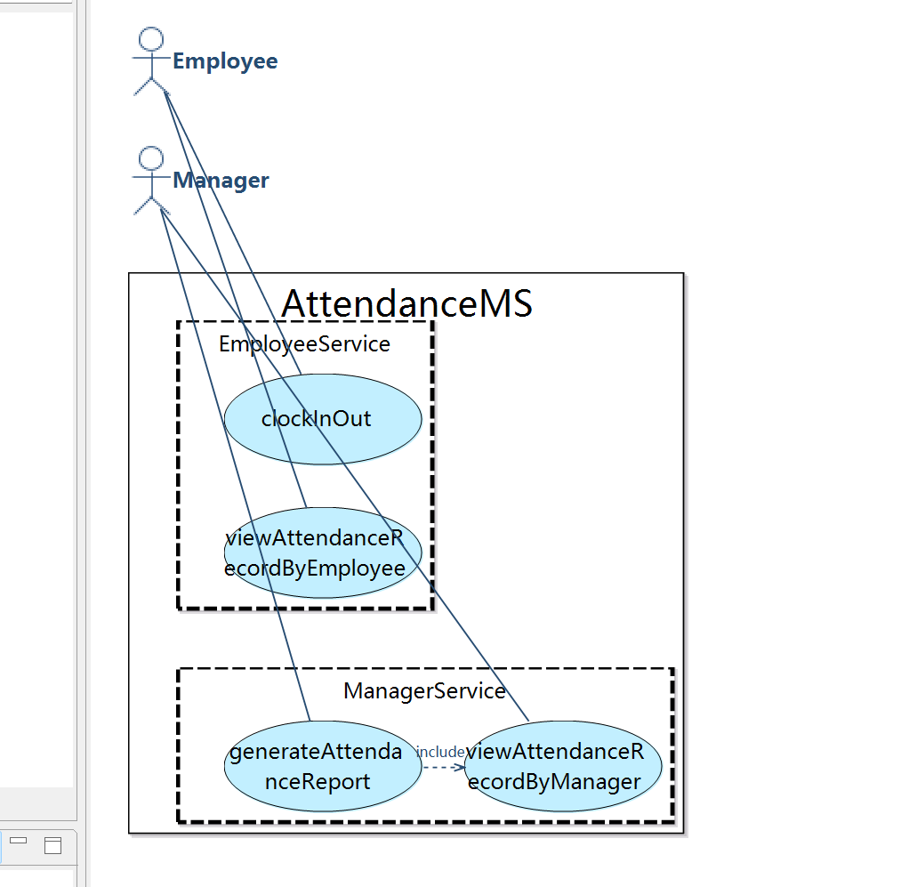
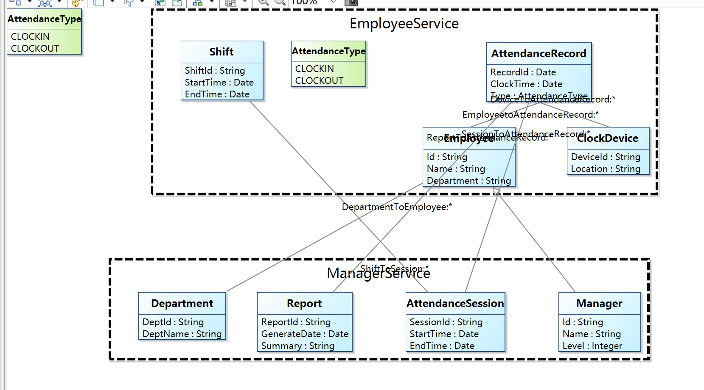

考勤系统 
1.用例图 该用例图定义了考勤系统的核心功能，包含四个主要用例：ProcessClockInOut（处理签到/签退）、ViewAttendanceRecordByEmployee（员工查看记录）、ViewAttendanceRecordByManager（经理查看记录）、GenerateAttendanceReport（生成考勤报告）。 参与者包括 Employee（员工）、Manager（经理）和 System（系统），其中系统通过 <> 关系支持自动关联班次和记录设备使用。

2.概念类图 概念类图定义了考勤系统的七个核心实体：Employee（员工）、Manager（经理）、AttendanceRecord（出勤记录）、AttendanceSession（出勤会话）、Report（报告）、CheckInDevice（打卡设备）、Shift（班次）。

3.顺序图 顺序图共 4 个，分别对应四个用例，展示员工和经理与系统之间的交互。

4.系统操作总数: 12 个 CheckInOutService: startClockIn, recordClockTime, endClockIn, ViewWorkoutRecordByMemberService: requestAttendanceRecord, retrieveAttendanceData, displayAttendanceRecord, ViewWorkoutRecordByStaffService: selectEmployeeRecord, fetchEmployeeAttendance, showEmployeeRecord,GenerateWorkoutReportService: initiateReportGeneration, compileAttendanceData, generateReport 系统合约数量: 12 个（每个操作对应一个 OCL 合约）

任务二相关截图：

